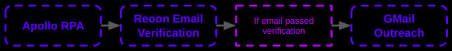

# Done for You, Multi-Channel Outreach System

With [**MassProspecting**](https://massprospecting.com) it is very simple to build outreach campaigns on **LinkedIn**, **Facebook** and **Email**.

**Example:**

The picture below is an example of a very simple workflow that scrapes emails from [Apollo](https://www.apollo.io), verify them using [Reoon](https://emailverifier.reoon.com), and sending an email with [GMail](https://gmail.com).

**Documentation Outline:**

- [User Documentation](#user-documentation)
- [Integrations](#integrations)
- [API](#api)
- [Case Studies](#case-studies)
- [Internals](#internals)

## User Documentation

Step by step tutorials about how to use the user interface of MassProspecting.

1. [Getting Started.](/user/01-getting-started.md)
2. [SubAccounts Overview](/user/02-sub-accounts-overview.md)
3. [Bring Your Own Profiles.](/user/03-bring-your-own-profiles.md)
4. [Import Leads.](/user/04-import-leads.md)
5. [Lead Sources.](/user/05-lead-sources.md)
6. [Leads Management.](/user/06-leads-management.md)
7. [Tags Management.](/user/07-tags-management.md)
8. [Leads Enrichment.](/user/08-leads-enrichment.md)
9. [Emails Verification.](/user/09-emails-verification.md)
10. [Setting up Cold Emails.](/user/10-setting-up-cold-emails.md)
11. [Setting up LinkedIn Connection Requests.](/user/11-setting-up-linkedin-connection-requests.md)
12. [Setting up Facebook Friend Requests.](/user/12-setting-up-facebook-friend-requests.md)
13. [Setting up a LinkedIn Follow Up Series.](/user/13-setting-up-a-linkedin-follow-up-series.md)
14. [Setting up a Facebook Follow Up Series.](/user/14-setting-up-a-facebook-follow-up-series.md)

**Advanced:**

15. Advanced Sources Configuration

## Integrations

Tutorials about how to connect MassProspecting with other platforms.

1. [GMail or GSuite](/integrations/01-gmail-or-gsuite.md)
2. [PostMark](/integrations/02-postmark.md)
3. [Generic MTA](/integrations/03-generic-mta.md)
4. [LinkedIn](/integrations/04-linkedin.md)
5. [Facebook](/integrations/05-facebook.md)
6. [Apollo](/integrations/06-apollo.md)
7. [Reoon](/integrations/07-reoon.md)
8. [ZeroBounce](/integrations/08-zerobounce.md)
9. [Zyte](/integrations/09-zyte.md)
10. [OpenAI](/integrations/10-openai.md)
11. [AdsPower](/integrations/11-adspower.md)

## API

1. [Getting API key](/api/001-getting-api-key.md)

## Case Studies

Workflow examples about how to connect different sources of data with different outreach channels.

1. [Case Study 1: Building Lists with Apollo RPA.](/case-studies/01-case-study-1:-building-lists-with-apollo-rpa.md)
2. [Case Study 2: Scraping Indeed, Enriching with Apollo RPA, Verifying, Sending Outreach.](/case-studies/02-case-study-2:-scraping-indeed,-enriching-with-apollo-rpa,-verifying,-sending-outreach.md)
3. [Case Study 3: Scraping LinkedIn Public Feed, Enriching with Apollo RPA, Verifying, Sending Outreach.](/case-studies/03-case-study-3:-scraping-linkedin-public-feed,-enriching-with-apollo-rpa,-verifying,-sending-outreach.md)
4. [Case Study 4: Scraping Facebook Public Feed, Sending Outreach.](/case-studies/04-case-study-4:-scraping-facebook-public-feed,-sending-outreach.md)
5. [Case Study 5: Scraping Facebook Group Posts, Sending Outreach.](/case-studies/05-case-study-5:-scraping-facebook-group-posts,-sending-outreach.md)
6. [Case Study 5: Double Email Verification.](/case-studies/06-case-study-5:-double-email-verification.md)
7. [Case Study 6: Catch-All Re-Verification.](/case-studies/07-case-study-6:-catch-all-re-verification.md)

## Internals

How does MassPropspecting work internally.

1. [Architecture](/internals/01-architecture.md)
2. [Installation](/internals/02-installation.md)
3. [Checklist: Profiles Revision Procedure](/internals/03-checklist-profiles-revision-procedure.md)

**Other Documents:**

- [Installation (Legacy Procedure)](/internals/02-installation-legacy.md)