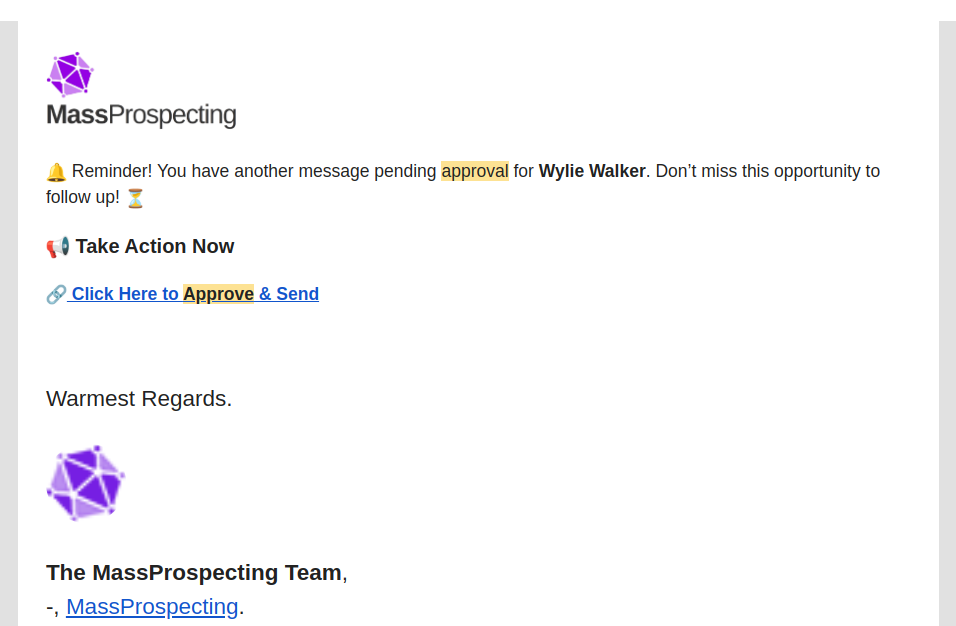
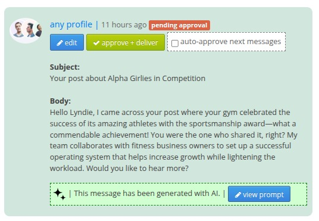
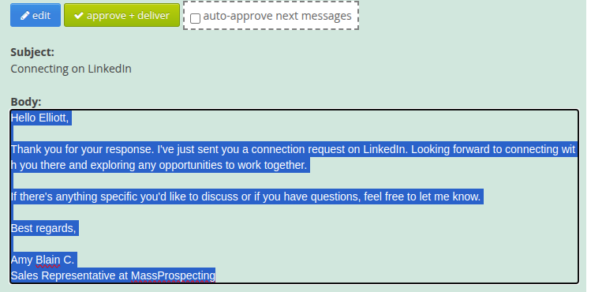
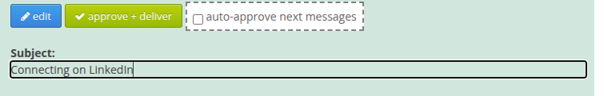
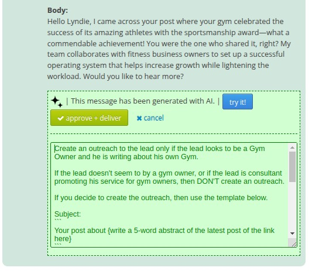

# ✅ Approving Outgoing Messages (Like a Pro!)

When you kick off a workflow in MassProspecting, your system is pretty much ready to roll. 🚀

But some things still need a quick review from you—especially the **messages** sent to your leads.

Let’s walk through how to check, edit, and approve them in a breeze.

---

## 📬 Getting the Notification

Whenever MassProspecting finds a great lead and writes a custom AI-generated message for them, you’ll get an email like this:

Click the link. It takes you straight to your pending message screen:

---

## ✏️ Editing the Message

See something you want to change? Easy.

Click the blue **Edit** button, or just click directly on the body text—it becomes instantly editable!

Want to tweak the subject line too? Click on it and boom—it’s editable:

---

## ✅ Approving and Delivering

Once the message looks 🔥, just hit the green **approve + deliver** button.

Done. Message sent. High five! ✋

---

## 🤖 Fine-Tuning the Prompt

That message? It was built by your AI Agent using a smart prompt.

If the message wasn’t quite right, maybe the prompt needs some love.

Click the **view prompt** button:

Now you’ll see the green prompt editor. Go ahead—revise it!

Click **try it!** to regenerate a fresh version of your message with the updated prompt:

Keep tweaking until it sounds just right. When it does, click **approve + deliver** right there in the prompt area.

---

## 🔁 Auto-Approval Mode

Tired of clicking approve every single time? 😅

If you've approved a bunch of messages without needing to make edits, it’s time to automate.

Just check the **auto-approve next messages** box:

Now, future messages will go out automatically—saving you clicks and time. 🎉

---

You're all set!

MassProspecting gives you the tools, but you’re still in control.

Review. Edit. Approve. Or automate. You’ve got this. 💪