# 🚀 How to Build an Unstoppable Outreach System (and actually get replies!)

Getting a 5% or 10% response rate from cold outreach? Easy!

The secret?

👉 **Reach the right person, at the exact right moment.**

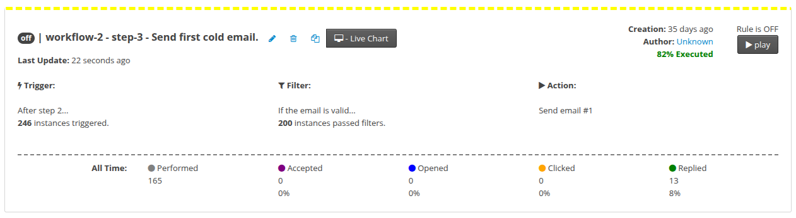

Nope—not the dreaded \"UNSUBSCRIBE\" or boring \"Out Of Office\" replies.

We're talking actual, real, positive replies like these:

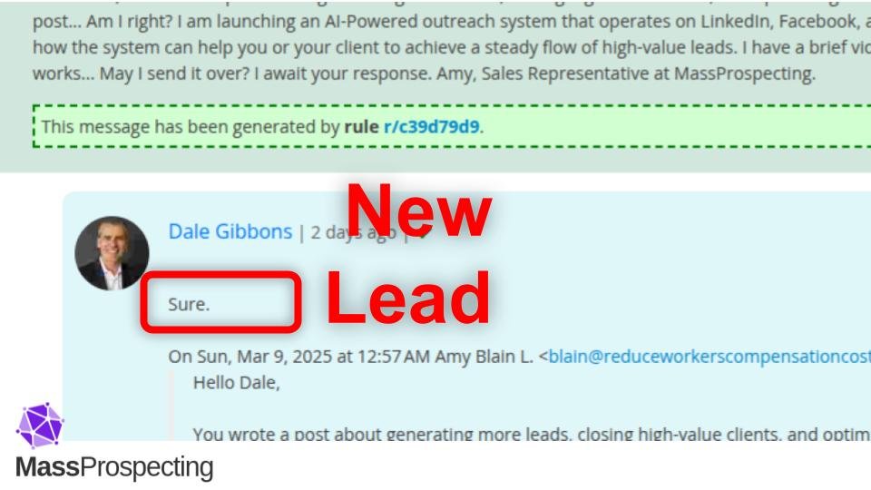

---

## 🕵️‍♂️ Find Those Golden Opportunities!

MassProspecting provides slick scraping tools that help you spot people who urgently need exactly what you offer:

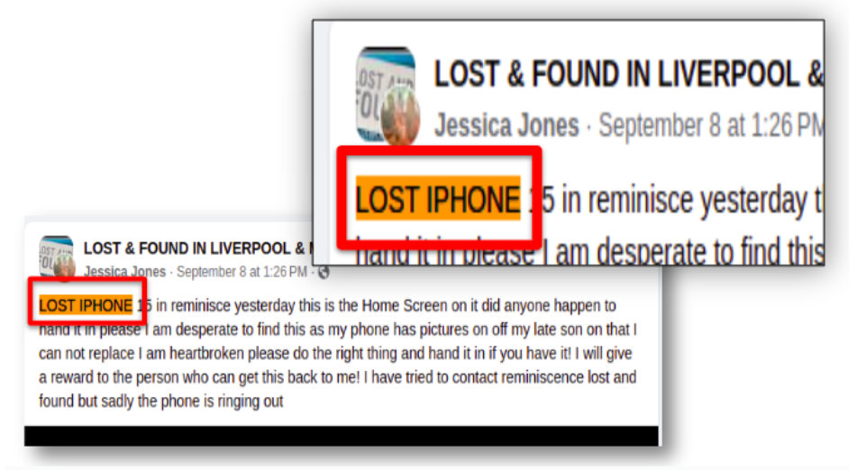

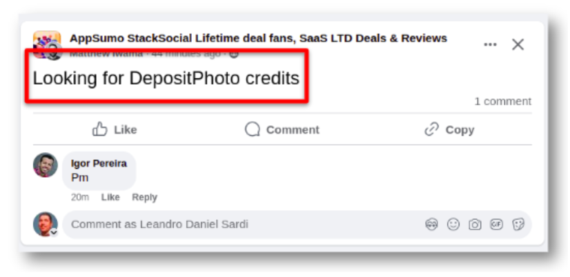

Or, even better, find people posting content that screams, **\"Hey! Sell me something awesome!\"** (Ok, not literally, but pretty close!):

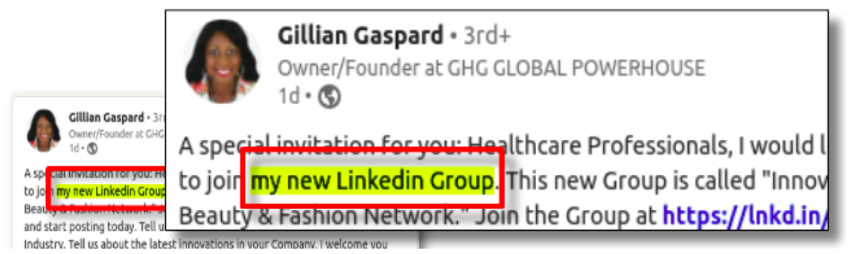

Yeah, MassProspecting makes spotting these opportunities a breeze.

---

## 🛠️ Customize Your Outreach with an AI-Agent (Easy-Peasy!)

You've spotted the opportunity. Awesome! But now what?

Time to craft that irresistible message.

MassProspecting’s **AI-Agent setup** screen makes this almost too easy:

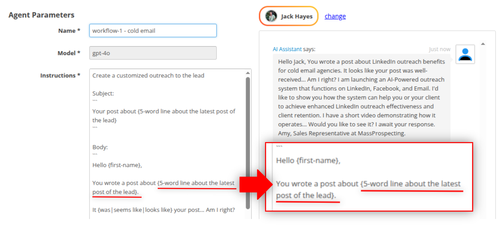

But wait... sometimes \"easy\" isn't enough, right?

Let's level up. 🔥

---

## 🎯 Two Barriers You Must Crush to Get Replies

### 🚧 Barrier #1: Catch Their Attention!

Your first job? Get noticed.

You have about 2 seconds before your email joins the graveyard of unread emails.

Solution?

MassProspecting puts a tiny piece of the lead’s own content directly into your subject line and email body.

What does that do?

It practically forces the lead to open and actually read your message.

### 🚧 Barrier #2: Spark Their Interest!

Getting opened is half the battle. The next challenge? Getting a reply.

Here’s where MassProspecting’s AI-agent truly shines:

The AI-agent crafts a proposal tailored to **precisely match the issue or topic the lead is discussing in their post**. You're not just sending a generic message; you're solving exactly what your lead cares about.

Check this out:

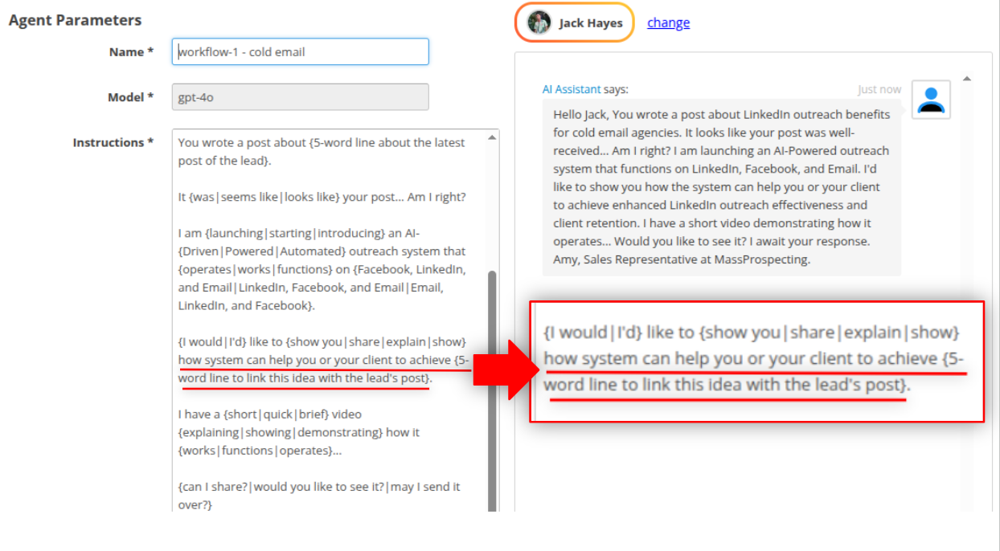

This ensures your message is **personalized, relevant, and irresistible**.

You’ll turn curious opens into eager replies, every time.

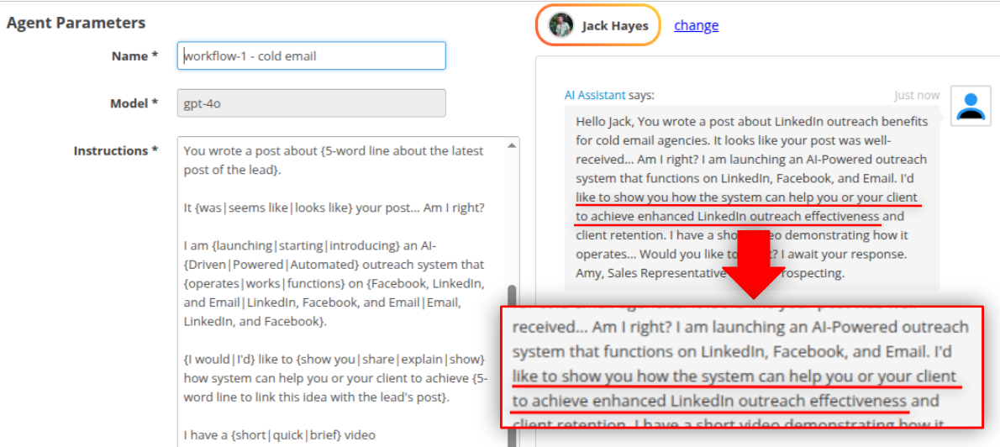

---

## 🏆 Real-Life Wins

Check out these actual replies:

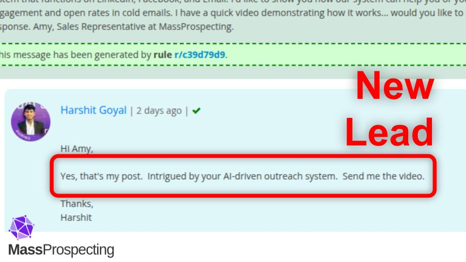

Or this:

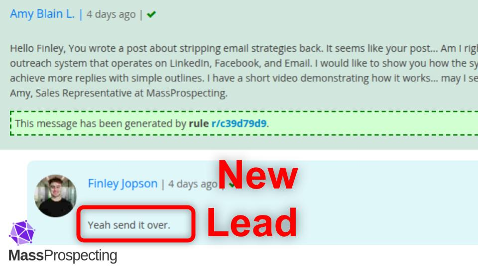

And even these short-and-sweet replies:

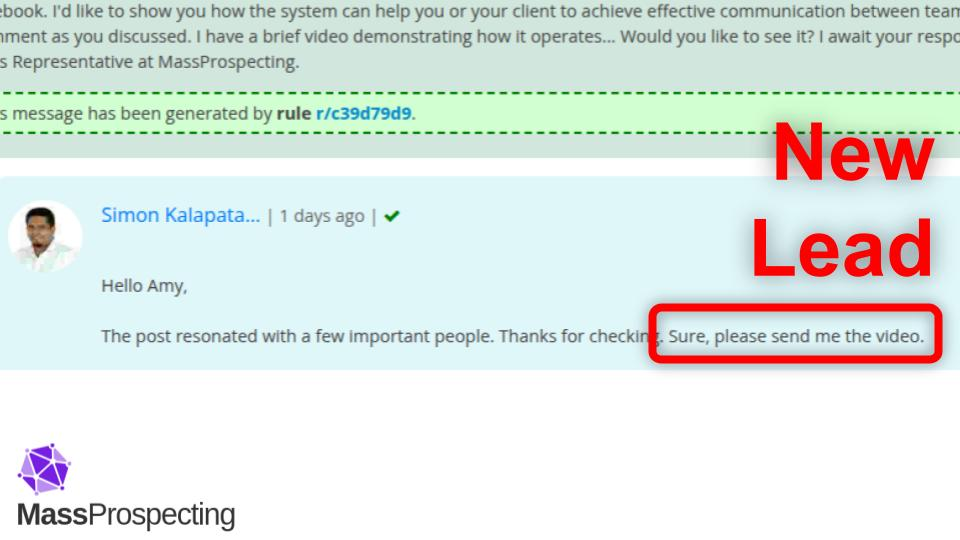

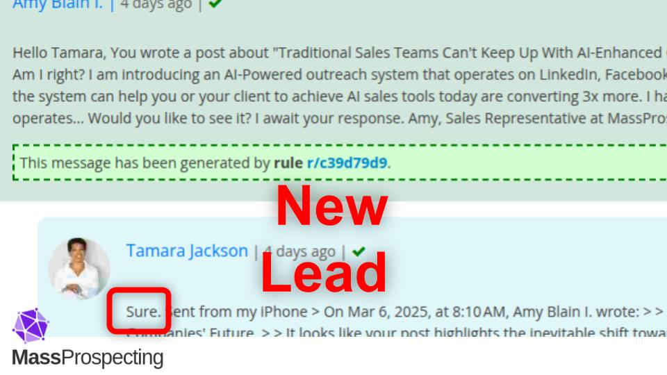

---

🔥 **Ready to build your unstoppable outreach system?** Let’s go get those replies!

No more ghosts. Just warm, welcoming inboxes.

