# Case Study: Indeed Workflow

- [Part 1: Scraping Indeed Jobs](#part-1-scraping-indeed-jobs)
- [Part 2: Filtering Scraped Companies](#part-2-filtering-scraped-companies)
- [Part 3: Find CEOs of Tagged Companies and Their Emails](#part-3-find-ceos-of-tagged-companies-and-their-emails)
- [Part 4: Verify Emails with Reoon](#part-4-verify-emails-with-reoon)
- [Benchmarks](#benchmarks)

## Part 1: Scraping Indeed Jobs

1. Connect your Zyte account to MassProspecting.
So it will be ready to start scraping Indeed. 

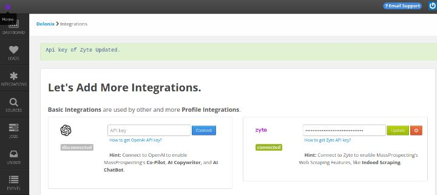

2. In the marketplace, lease 2 profiles:

- An Apollo RPA profile for appending the CEOs of the companies you'll scrape from Indeed.

- A Reoon LTD for running email verification of such CEOs' emails.

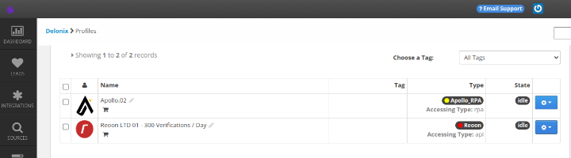

3. Copy your Indeed search URL and create a new source.

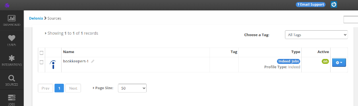

**Pro Tip:** To improve a bit your Indeed search, sort results by date, so we'll find the most recent jobs posts and avoid abandoned openings.

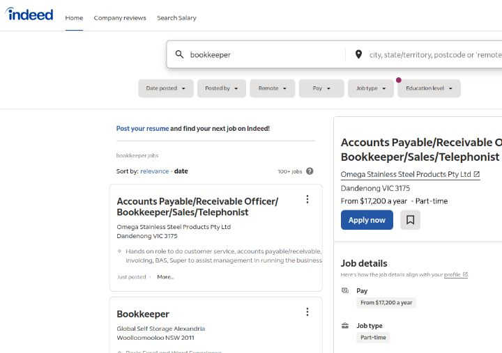

After you have created your source, you can find the jobs peformed in the jobs screen:

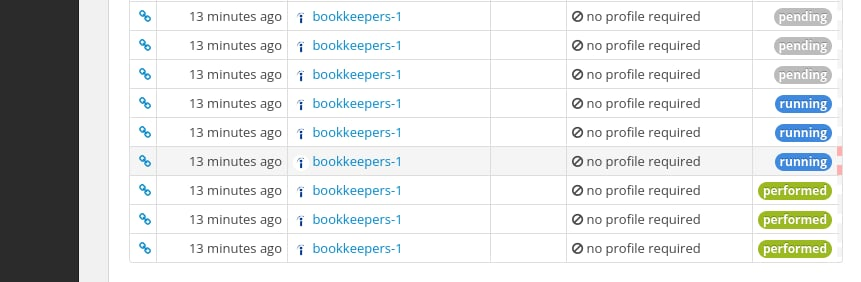

In the leads section, you can find the companies scraped:

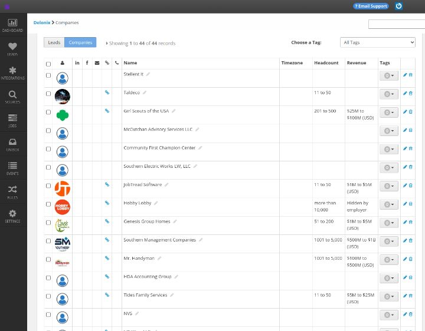

## Part 2: Filtering Scraped Companies

The next step is to add a tag to all the companies with a headcount between 0 and 200.

1. Created a new tag called "hiring bookkeepers"

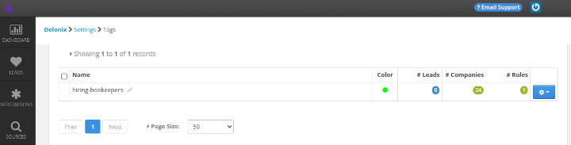

2. Create a rule that:

- takes all the new companies scraped by our source, 
- filter the ones with a headcount from 0 and 200 only, and 
- add the tag "hiring-bookkeepers".

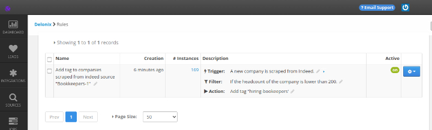

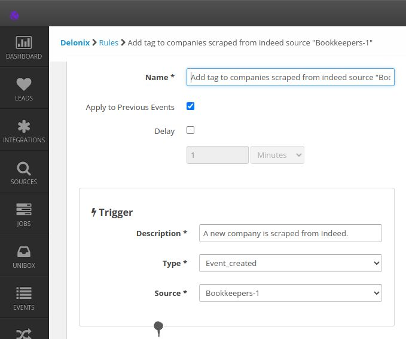

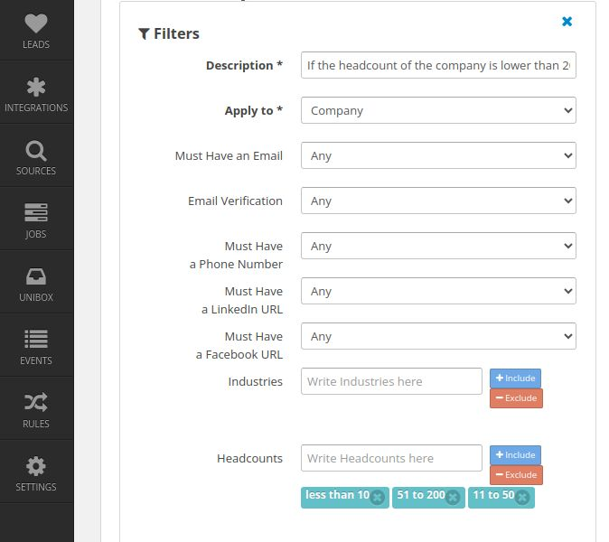

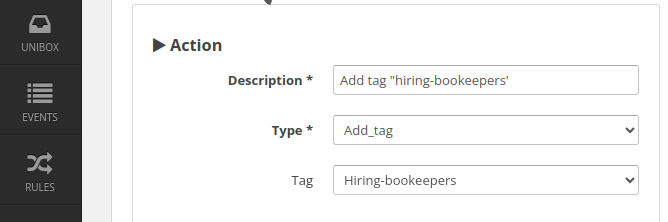

## Part 3: Find CEOs of Tagged Companies and Their Emails

The next step is to use Apollo to find the CEOs Owners Founders or Managing Dirctors of the tagged companies.

We are going to scrape Apollo instead of using their API.

The pros: Scraping Apollo is 10X cheaper than using their API.

The cons: Scraping account requires we manage a low rate of pageviews per minute. So, the enrichment process is slower than using the API.

## Part 4: Verify Emails with Reoon

(pending)

## Benchmarks

(pending)