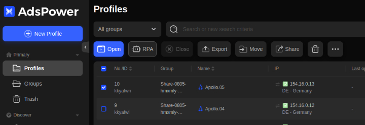
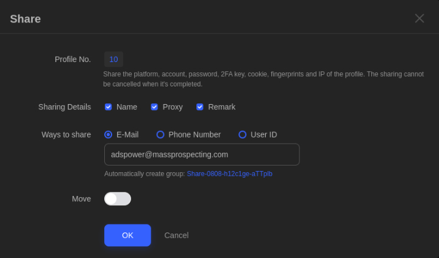

# How to Add Your AdsPower Profiles to MassProspecting

Follow the steps below if you want to add your own AdsPower profiles to your [MassProspecting](https://massprospecting.com) account.

Step 1: Select the profiles you want to share in AdsPower.

Step 2: Click the "Share" button.

Step 3: Check **Name**, **Proxy** and **Remark** in the "Sharing Details" section.

Step 4: Choose **E-Mail** in the "Ways to share" section.

Step 5: Write adspower@massprospecting.com in the text field.

Step 6: Disable the "Move" toggle.

Step 7: Click "OK"

After you have completed the sharing process, your MassProspecting support agent must to check them before setting.

**Some Considerations:**

1. Don't use IP authentication in your proxies. Use user/password authentication instead.