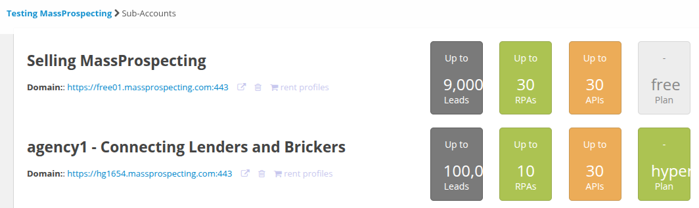
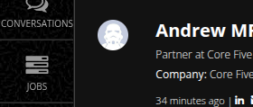
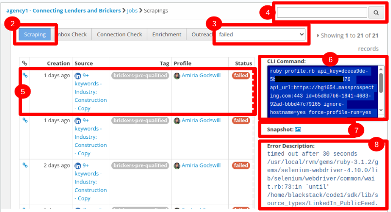
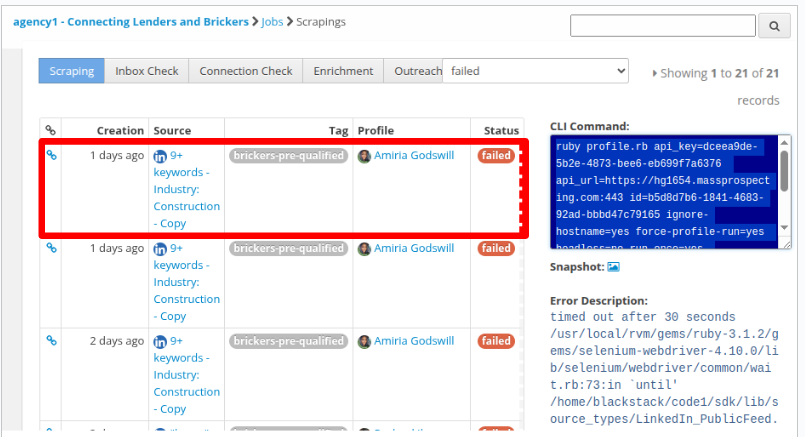
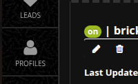
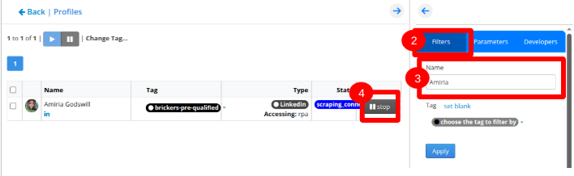

# Working with SDK

Every time you run a scraping job, or an enrichment, or an outreach from [MassProspecting](https://massprospecting.com); such a job is performed by the [**SDK**](https://github.com/massprospecting/mass-sdk).

Every single step in your [MassProspecting Workflow](https://github.com/MassProspecting/docs) is perfrmed by the [**MassProspecting SDK**](https://github.com/MassProspecting/mass-sdk).

The **MassProspecting SDK** is executed by the [worker nodes of our architecture](https://github.com/MassProspecting/docs/blob/main/internals/01-architecture.md).


## 1. Abstract 

This document explain how to find failed jobs (scraping, enrochment, outreach, etc.) and replicate them in out local computer for debugging and fixing.

## 2. Accessing User's Accounts

Access your MassProspecting account with **admin grants**.

1. Login to MassProspecting here:
[https://massprospecting.com/login](https://massprospecting.com/login)

2. Go to the list of Users here:
[https://massprospecting.com/monitoring/users](https://massprospecting.com/monitoring/users)

3. Find the the purple **SysOwner** badget. That means that you can find and user of MassProspecting in such a screen.

If you don't have a **SysOwner** badge, then ask your team leader for the right grantes for managing other users' accounts.


4. In the screen above, use the search box in the top-right corner to search for the user you want to access.

5. Once you found the user you want to access, click on the **copy icon** that you can find in the **Access Link** column.

Such a link is for accessing the user's account in another browser, with out the need of writing its password.

6. Since you can't loging to 2 MassProspecting accounts in the same browser; open a new browser in **incognito mode** in order to access the user's account.

In the new **incognito browser**, paste the link you copied in the previous step.

7. Once you accessed the user's account, go to the [**sub-accounts screen**](https://massprospecting.com/subaccounts), access the user's subaccount. 



## 3. Finding Failed Jobs

1. Once you have accessed the user's subaccount, find the **jobs** icon in the left-bar and click on it.



2. In the jobs screen, you can choose beetween the diffent tye of jobs (scraping, enrichment, outreach, etc.)

Go to the type of jobs you want to work with (e.g: **scraping**)



3. Filter the jobs with status **failed**.

4. Optionally, you can write the name of the **profile** you want to work with or even the name of the **lead** (if you are working on enrichment jobs or outreach jobs).

5. Click on one of the results to see such a result's details in the right-side panel.

6. Find the **command** to execute such a job in your computer.

7. Optinonally, click on the **snapshot** icon to get the exact HTML code of the website at the moment the failure happened.

8. Optionally, find the **backtrace** of the exception that generated such a failure.

## 4. Stopping the Profile

In the previous chapter, you foud a job that failed (step 5), and you grabbed the **command** to run such a job in your local computer (step 6).

For running any job in your local computer, you must stop the **profile** running on production servers.

( In other workds: One profile can't be running in more than one computer at the same time )

In the screenshot below, the choosen **job** is assigned to a **profile** called _Amiria_



For stopping a profile, follow the steps below:

1. Find the **profiles** icon in the left-side bar, and click on it.



2. In the **profiles screen**, click on the **filters tab** 



3. Write the name of the profile you are looking for in the filter text-field, and press ENTER.

4. Once you found such a profile, click on the **stop button**.

## 5. Replicating the Glitch

Once in you found the job and you stopped its assigned profile, you can run it in your local computer.

1. Remember to switch to your Linux `blackstack` user.

```
su - blackstack
```

2. Setup your `RUBYLIB` environment variable.

```
export RUBYLIB=~/code1/sdk
```

3. Go to the folder `~/code1/sdk/p`

```
cd ~/code1/sdk/p
```

4. Optionally, you can create the `.sandbox` flag in order to place **brackpoints** in your source code, by placing the Ruby line `binding.pry`.

```
touch .sandbox
```

5. Execute the **command**.

```
ruby profile.rb 
api_key=dceea9de-****-****-****-******a6376 api_url=https://hg1654.massprospecting.com:443 id=b5d8d7b6-1841-4683-92ad-bbbd47c79165 ignore-hostname=yes force-profile-run=yes headless=no run-once=yes inboxcheck=no connectioncheck=no scraping=yes id_job=0e513ab3-cabf-4823-bea3-41d306912148 enrichment=no outreach=no 
```


