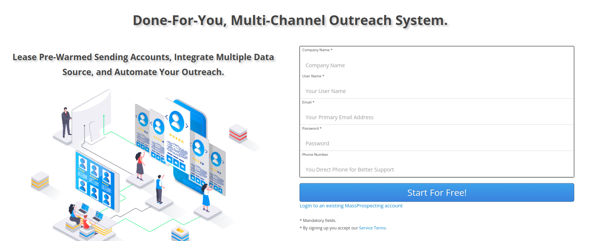

# Getting Started

## Abstract

Welcome to MassProspecting! This platform integrates tools to create powerful prospecting workflows.  

MassProspecting is not just a multichannel outreach tool. It lets you connect with leads on LinkedIn, Facebook, and via email. You can scrape leads, analyze their behavior, and use AI to send tailored messages.  

But that’s not all. You can integrate third-party tools like Apollo for lead enrichment or Reoon for email verification. With these integrations, MassProspecting acts more like an advanced integration tool, similar to Zapier.  

This tutorial will guide you through the first steps to master MassProspecting.  

### Topics Covered

- Signing Up  
- Sub-Account Management  
- Reference Workflows  
- Profiles Leasing  
- Adding Your Own Profiles  

### Tutorial Outline

1. Signing Up  
2. Choosing a Plan or Going for Free  
3. Creating a Sub-Account  
4. Selecting Profiles from the Marketplace  
5. Accessing Your Sub-Account  
6. Assigning Profiles  
7. Adding Your Own Profiles  

  

## 1. Signing Up  

Start your journey here: [Sign Up](https://massprospecting.com/signup)  

  

### Benefits  

Signing up gives you access to a world of automation and prospecting opportunities. The next step explains how to select a plan that fits your needs.  

  

## 2. Choosing a Plan or Going for Free  

After signing up, you’ll find different plans. Visit [Plans Page](https://massprospecting.com/plans).  

  

A free plan is also available if you want to start without a subscription.  

  

### Benefits  

Choose a plan that matches your business size and goals. The free plan lets you test the platform without commitment. In the next step, you'll learn to create sub-accounts.  

  

## 3. Creating a Sub-Account  

After selecting a plan, you’ll be redirected to create a sub-account. Or visit [Create Sub-Account](https://massprospecting.com/subaccounts/new).  

  

Each sub-account is tied to one plan. With the free plan, you can create one sub-account.  

### Benefits  

Sub-accounts help you manage different clients or business sectors. In the next step, discover how to find profiles in the marketplace.  

  

## 4. Selecting Profiles from the Marketplace  

Once a sub-account is created, you’ll reach the marketplace. Here, pick the profiles you need for outreach and scraping.  

  

The marketplace offers:  

- Pre-warmed LinkedIn and Facebook profiles.  
- GMail/GSuite profiles for cold emails.  
- Apollo profiles for bulk scraping and lead enrichment.  
- Reoon profiles for email verification.  
- PostMark profiles for warm email campaigns.  

Click "Add" on the profiles you need, then "Checkout".  

### Benefits  

Renting pre-configured profiles saves time and boosts efficiency. Next, you’ll learn how to access your sub-account.  

  

## 5. Accessing Your Sub-Account  

After picking profiles, access your sub-account here: [Sub-Accounts](https://massprospecting.com/subaccounts).  

  

Inside your sub-account, set up custom workflows.  

For advanced workflow setup, check our guide: [Workflow Tutorial](...).  

### Benefits  

Accessing sub-accounts ensures easy profile management. In the next step, learn about assigning profiles.  

  

## 6. Assigning Profiles  

Assign the rented or created profiles to your workflows.  

  

### Benefits  

Assigning profiles links resources to tasks seamlessly. Next, we’ll explore how to add your own profiles.  

  

## 7. Adding Your Own Profiles  

Bring your own profiles to customize your workflows.  

  

Profiles fall into three categories:  

- **API (Application Programming Interface)**  
  Examples: Apollo, Reoon. Ideal for enrichment and verification.  

- **MTA (Mail Transfer Agent)**  
  Examples: GMail, PostMark. Use for cold or warm email campaigns.  

- **RPA (Robotic Process Automation)**  
  Examples: LinkedIn, Facebook. Automate actions unavailable via APIs.  

  

Learn more here: [Profile Setup Guide](https://github.com/MassProspecting/docs/blob/main/user/03-registering-your-profiles.md).  

### Benefits  

Adding your own profiles enhances flexibility. In the next tutorial, explore building workflows and leveraging AI.  