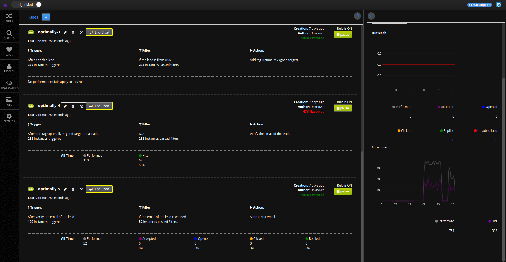
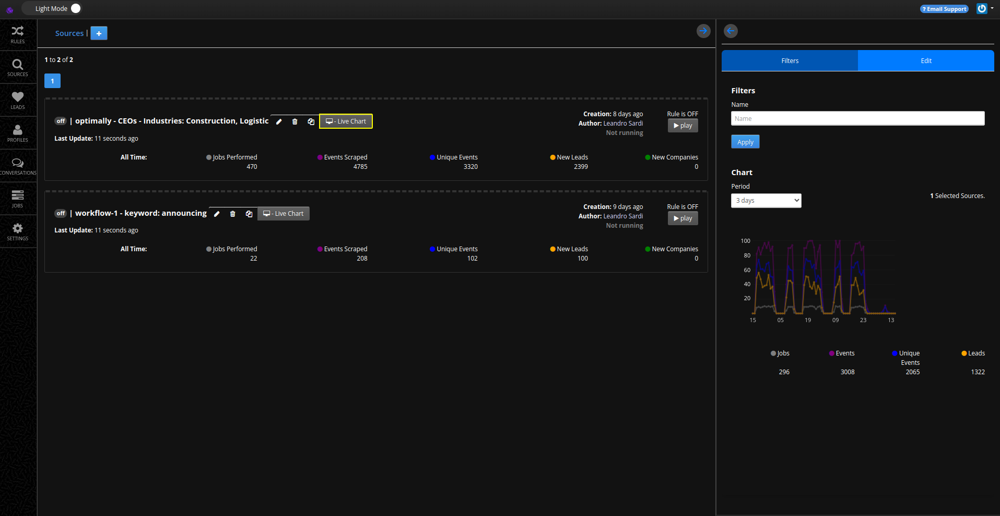
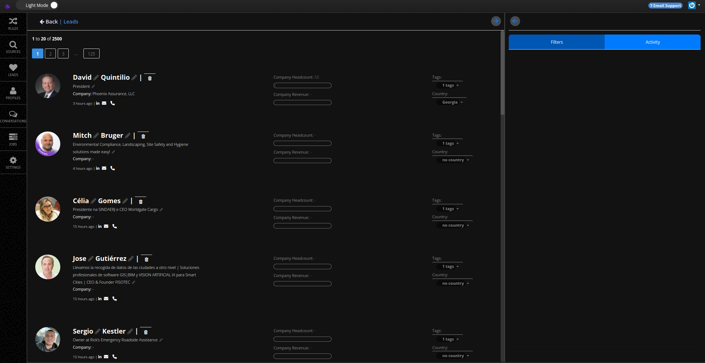
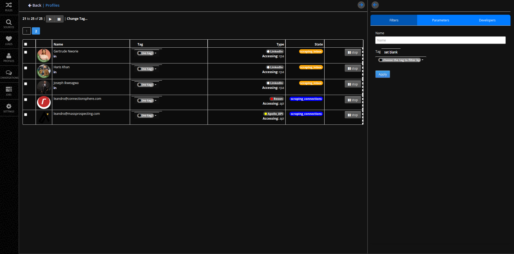

# SubAccounts Overview

In the [Getting Started tutorial](./01-getting-started.md#5-accessing-your-sub-account), you learned what a sub-account is and how to access it.

## Rules Screen

The sub-account dashboard is where you manage and monitor your workflows.

It is divided into several sections:

1. **Rules Panel**  
   - Displays all the active and inactive rules in your sub-account.  
   - Each rule shows details like triggers, filters, and actions.  
   - You can toggle rules on/off, view live charts, and monitor execution statistics.  

2. **Filters Section**  
   - Apply filters to quickly locate specific rules by name.  
   - Refine your workflow management based on recent activity or rule performance.  

3. **Charts and Metrics**  
   - Visualize outreach and enrichment performance over a selected time period.  
   - Metrics include performed actions, accepted invitations, opened emails, and more.  

4. **User Details Panel**  
   - Located at the top right. Shows your email, company name, and sub-account details.  
   - Access settings and support options directly from this panel.  

## Benefits of the Sub-Account Dashboard

- **Centralized Control:** All workflows and rules are managed from one place.  
- **Real-Time Insights:** Charts and stats provide up-to-date performance data.  
- **Customization:** Filters and toggles make it easy to focus on specific workflows.  

In the next chapter, you'll learn how to set up and optimize workflows to improve your outreach and enrichment performance.

---

## Sources Screen

The **Sources Screen** allows you to manage and track all the data sources connected to your sub-account.

1. **Source Panel**  
   - Lists all available data sources and their statuses.  
   - Shows details such as jobs performed, events scraped, unique events, and new leads generated.  

2. **Filters Section**  
   - Quickly locate specific sources by applying name filters.  
   - Focus on individual source performance or troubleshoot inactive sources.  

3. **Charts and Performance Metrics**  
   - Displays a timeline of performance metrics like jobs, events, and leads.  
   - Provides an overview of historical and real-time activity for each source.  

---

## Leads Screen

The **Leads Screen** is where you can view, edit, and manage the leads generated from your workflows.

1. **Leads List**  
   - Displays a paginated list of leads with details like name, job title, and company.  
   - Includes quick-action buttons for editing, deleting, or accessing a lead's profile.  

2. **Filters Section**  
   - Narrow down the lead list using filters like tags, country, or activity timestamps.  

3. **Details and Interaction Options**  
   - Shows additional lead data like company headcount and revenue (if available).  
   - Provides quick links for email, phone, and LinkedIn interactions.  

---

## Profiles Screen

The **Profiles Screen** helps you manage user profiles and connections from various platforms.

1. **Profile List**  
   - Displays all available profiles along with their tags, type, and access method (e.g., API, RPA).  

2. **State Management**  
   - Shows the current state of each profile (e.g., scraping inbox, scraping connections).  
   - Includes controls to start/stop processes for each profile.  

3. **Filters and Parameters**  
   - Apply filters to locate profiles by name or tags.  
   - Adjust parameters for custom profile management or troubleshooting.  

4. **Developer Tools**  
   - Access advanced options for developers, enabling deeper integration with external APIs or scripts.  

---

With these tools and features, you can efficiently manage your workflows, data sources, and leads to achieve your prospecting goals. For more detailed guidance, refer to the [Workflows Setup Guide](./workflows-setup.md).
