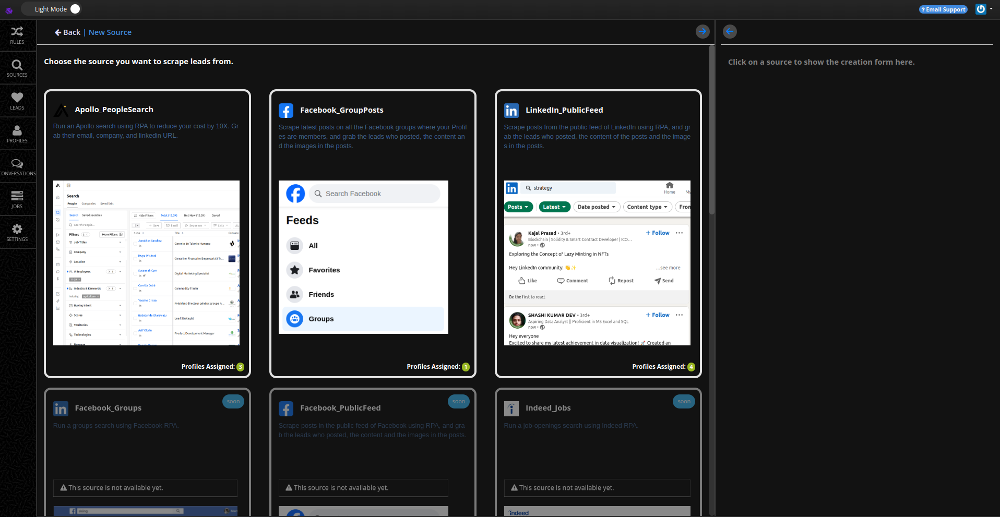
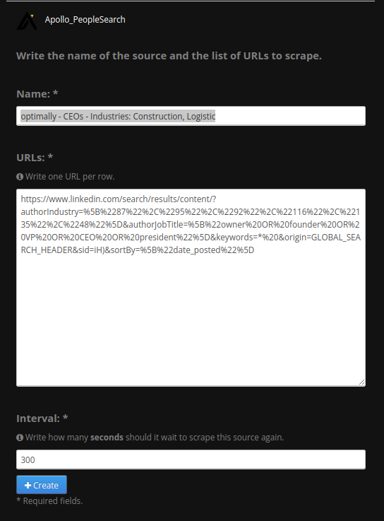
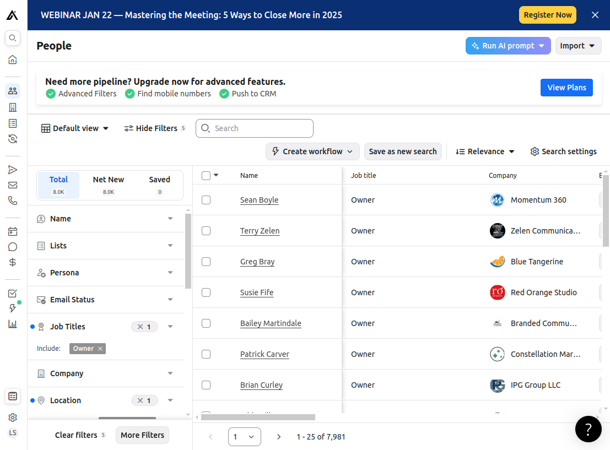
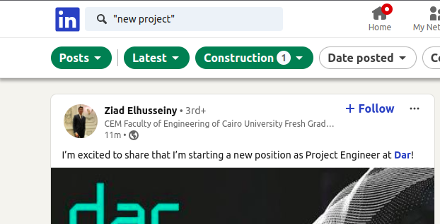

# Lead Sources

If you'd prefer to scrape leads instead of [importing them](/user/4-import-leads.md), you can set up a new **source** in one of your [sub-accounts](/user/1-getting-started.md#2-setup-your-sub-account).

## Accessing a Sub-Account

To create a lead source, follow these steps to access the appropriate sub-account:

1. **Login to your MassProspecting account**: [https://massprospecting.com/login](https://massprospecting.com/login).
2. In the left menu, click **Subaccounts**.
3. Select the sub-account where you want to add your lead sources.

## Adding a New Source

1. Inside your sub-account, click on **Sources** in the left menu.
2. Click the **plus button** in the top bar to create a new source.
3. On the **New Source** screen, select the type of source you want to scrape.

You will be prompted to provide three parameters for the new source:

1. **Name**: A descriptive name for your source.  
2. **URLs**: One or more URLs to replicate your search for scraping.  
3. **Interval**: The time (in seconds) between each job execution.

## Source Types

### 1. Apollo People Search

Apollo People Search allows you to build targeted lead lists based on job positions, locations, company size, industry, and other data points.

- **URL Example**:  
  [https://app.apollo.io/...](https://app.apollo.io/#/people?page=1&sortAscending=false&sortByField=%5Bnone%5D&personTitles[]=Owner&personLocations[]=United%20States&organizationNumEmployeesRanges[]=11%2C20&organizationNumEmployeesRanges[]=21%2C50&organizationIndustryTagIds[]=5567cd467369644d39040000)

#### Notes:
- Each scraping job processes one page of search results.
- Set the **interval** to `0` since Apollo automatically moves leads you’ve already scraped to the end of the list.
- Assign **one Apollo profile** per source to ensure accurate scraping.

### 2. Facebook Group Posts

Scrape the latest posts from Facebook groups that the assigned profile has joined.

- **URL Example**:  
  [https://www.facebook.com/?filter=groups&sk=h_chr](https://www.facebook.com/?filter=groups&sk=h_chr)

#### Notes:
- Ensure the profile used for scraping is joined to the relevant Facebook groups.
- If you’re leasing Facebook profiles, contact support to have your profiles added to specific groups.

### 3. LinkedIn Public Feed

Use the LinkedIn Public Feed to find leads based on specific behaviors or activities, such as posting about their latest projects.

- **URL Example**:  
  [https://www.linkedin.com/...](https://www.linkedin.com/search/results/content/?authorIndustry=%5B%2248%22%5D&authorJobTitle=%5B%22owner%20OR%20founder%20OR%20VP%20OR%20CEO%20OR%20president%22%5D&keywords=%22last%20project%22&origin=FACETED_SEARCH&sid=quM&sortBy=%5B%22date_posted%22%5D)

#### Key Features:
- Filter by:
  - **Latest posts**: Focuses on recent behavior.
  - **Author keywords**: Targets specific job titles.
  - **Industry**: Narrow your audience by field of work.

#### Notes:
- Set the **interval** based on the frequency of new matching posts in the feed.
- LinkedIn Public Feed does not support filters for **location**, **country**, or **company size**. Use enrichment rules in your workflow to append this information for further filtering.

By following these steps and recommendations, you can efficiently set up and manage lead sources tailored to your prospecting needs.
