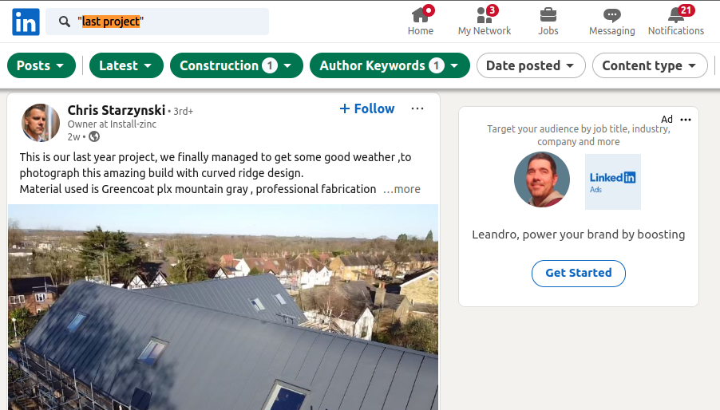

# Lead Sources

If you don't want to [import your leads](/user/4-import-leads.md), but scraping leads instead, you can setup a new **source** into one of your [sub-accounts](/user/1-getting-started.md#2-setup-your-sub-account).

So you have to access a sub-account first:

1. Login to your MassProspecting account [here](https://massprospecting.com/login).

2. In the left-bar, click on **subaccounts**.

3. Click on the sub-account where you want to add your profiles.

Once in your sub-account:

1. In the left-bar, click on **sources**.

2. In the top-bar, click on the **plus button**.

Once in the **New Source** screen, click on one type of source that you want to scrape.

.

You will be asked by 3 parameters:

1. A descriptive **name** for your new source.
2. One or more **URLs** to replicate your search for scraping.
3. The **interval** (in seconds) between each **jobs** execution.

.

Below are described the source types that are available today.

## Apollo People Search

Scraping Apollo is good to have build a list targeted by job position, location, company size, industry and more data-points.

URL Example: [https://app.apollo.io/#/people?page=1&sortAscending=false&sortByField=%5Bnone%5D&personTitles[]=Owner&personLocations[]=United%20States&organizationNumEmployeesRanges[]=11%2C20&organizationNumEmployeesRanges[]=21%2C50&organizationIndustryTagIds[]=5567cd467369644d39040000](https://app.apollo.io/#/people?page=1&sortAscending=false&sortByField=%5Bnone%5D&personTitles[]=Owner&personLocations[]=United%20States&organizationNumEmployeesRanges[]=11%2C20&organizationNumEmployeesRanges[]=21%2C50&organizationIndustryTagIds[]=5567cd467369644d39040000).

Each scraping job will process one page of the results.

The **interval** makes no sense in this kind of search. So, keep it `0`.

It is important you know that Apollo uses to move to the end the leads that you have scraped and picked up their emails. So **Apollo People Search** will always scrape the page `1`. It is important that you assign one and only one **Apollo** profile to each source.

## Facebook Group Posts

.

URL Example: [https://www.facebook.com/?filter=groups&sk=h_chr](https://www.facebook.com/?filter=groups&sk=h_chr).

Our **Facebook Group Posts** scrape the latest posts of all the Facebook groups joined by the **profile** that it is using for scraping.

So, it is important that you have your **profiles** joined to the right groups you want to scrape.

If you are leasing Facebook profiles, you can contact support and request to join your Facebook profiles to a list of specific groups.

## LinkedIn Public Feed

Scraping LinkedIn Public Feed is good to find leads with some specific behaviour.

E.g.: You can find Owners in the construction industry who are posting about their last project.

URL Example: [https://www.linkedin.com/search/results/content/?authorIndustry=%5B%2248%22%5D&authorJobTitle=%5B%22owner%20OR%20founder%20OR%20VP%20OR%20CEO%20OR%20president%22%5D&keywords=%22last%20project%22&origin=FACETED_SEARCH&sid=quM&sortBy=%5B%22date_posted%22%5D](https://www.linkedin.com/search/results/content/?authorIndustry=%5B%2248%22%5D&authorJobTitle=%5B%22owner%20OR%20founder%20OR%20VP%20OR%20CEO%20OR%20president%22%5D&keywords=%22last%20project%22&origin=FACETED_SEARCH&sid=quM&sortBy=%5B%22date_posted%22%5D)

.

Depending on how often new posts that matching with your filter appear in the feed, you will set the **interval** of your source.

Also, note that the **LinkedIn Public Feed** allows you to sort by **latest posts** (recommended to find leads based on a recent behaviour) and other filters like **author keywords** (useful to target by job positions) and **industry**.

.

The **LinkedIn Public Feed** doesn't support to filter by **locaction**, **country** or **company size**. So, in your workflow you will have to add an enrichment rule for appending such records for a further filtering.