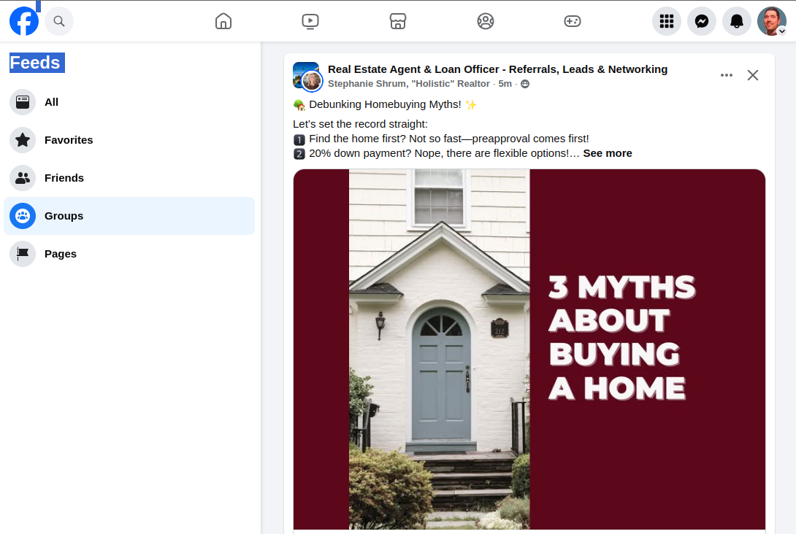

# Lead Sources

MassProspecting allows you to scrape leads by setting up **sources** in your [sub-accounts](/user/1-getting-started.md#2-setup-your-sub-account). Follow the instructions below to create and manage lead sources.

## Accessing a Sub-Account

To set up a lead source, start by accessing the appropriate sub-account:

1. **Login to your MassProspecting account**: [https://massprospecting.com/login](https://massprospecting.com/login).
2. In the left menu, click **Subaccounts**.
3. Select the sub-account where you want to create a lead source.

## Adding a New Source

1. Inside the sub-account, click on **Sources** in the left menu.
2. Click the **plus button** in the top bar to add a new source.
3. On the **New Source** screen, choose the type of source you want to scrape.

### Source Parameters

When creating a new source, you need to provide the following details:

1. **Name**: A descriptive name for your source.  
2. **URLs**: One or more URLs representing your search criteria for scraping.  
3. **Interval**: The time (in seconds) between job executions for this source.

## Types of Lead Sources

### Apollo People Search

Use Apollo People Search to build targeted lead lists based on criteria like job positions, locations, company size, and industry.

- **URL Example**:  
  [https://app.apollo.io/...](https://app.apollo.io/#/people?page=1&sortAscending=false&sortByField=%5Bnone%5D&personTitles[]=Owner&personLocations[]=United%20States&organizationNumEmployeesRanges[]=11%2C20&organizationNumEmployeesRanges[]=21%2C50&organizationIndustryTagIds[]=5567cd467369644d39040000)

**Important Notes:**
- Each scraping job processes one page of search results.
- Set the **interval** to `0` because Apollo automatically moves previously scraped leads to the end of the list.
- Assign **one Apollo profile** per source for accurate results.

---

### Facebook Group Posts

Scrape the latest posts from Facebook groups that the assigned profile has joined.

- **URL Example**:  
  [https://www.facebook.com/?filter=groups&sk=h_chr](https://www.facebook.com/?filter=groups&sk=h_chr)

**Important Notes:**
- The profile used for scraping must be a member of the relevant Facebook groups.
- If leasing Facebook profiles, contact support to add profiles to specific groups.

---

### LinkedIn Public Feed

Scrape the LinkedIn Public Feed to discover leads based on recent behaviors or activities, such as posts about their latest projects.

- **URL Example**:  
  [https://www.linkedin.com/...](https://www.linkedin.com/search/results/content/?authorIndustry=%5B%2248%22%5D&authorJobTitle=%5B%22owner%20OR%20founder%20OR%20VP%20OR%20CEO%20OR%20president%22%5D&keywords=%22last%20project%22&origin=FACETED_SEARCH&sid=quM&sortBy=%5B%22date_posted%22%5D)

**Key Features:**
- Filter by:
  - **Latest posts**: Focus on recent activities.
  - **Author keywords**: Target specific job titles.
  - **Industry**: Narrow the audience by field of work.

**Important Notes:**
- Set the **interval** based on the frequency of new matching posts.
- LinkedIn Public Feed does not support filters for **location**, **country**, or **company size**. Use enrichment rules in your workflow to append this information for further filtering.

By following these steps and recommendations, you can set up and manage lead sources efficiently, tailoring them to your prospecting needs.
