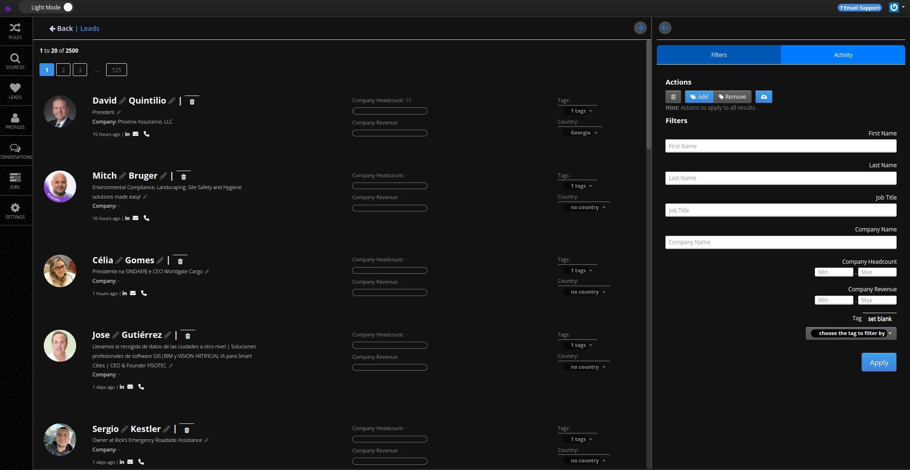

# Leads Management

Once you [import your leads](/user/4-import-leads.md) or [scrape leads](/user/5-scraping-leads.md), you can manage them on the **Leads Screen**. This interface allows you to view, filter, and manage leads efficiently, providing detailed information and options for bulk actions.

## Accessing a Sub-Account

To manage leads, start by accessing the appropriate sub-account:

1. Log in to your MassProspecting account [here](https://massprospecting.com/login).
2. In the left sidebar, click on **Subaccounts**.
3. Select the sub-account where your leads are stored.

## Accessing the Leads Screen

1. Inside the sub-account, click on **Leads** in the left sidebar.

## Using the Leads Screen

### Viewing Lead Details

1. Scroll through the list to locate a lead.
2. Click on a lead's name or job title to edit its details.
3. Use the contact icons (e.g., LinkedIn, email, phone) to interact directly with the lead.

### Filtering Leads

1. Enter criteria in the filter fields, such as job title or country.
2. Use dropdown menus to select tags or define numeric ranges for company headcount or revenue.
3. Click the **Apply** button to update the results and display matching leads.

### Managing Tags

1. Open the **Tags** dropdown for a lead to add, remove, or edit tags.
2. Use tags to categorize leads or refine search results.

### Performing Bulk Actions

1. Use the **Add**, **Remove**, or **Export** buttons in the **Actions** section to apply changes to all leads that match the filters.
2. Ensure you’ve set filters correctly before performing bulk actions to target the desired leads.

This screen provides a powerful way to manage and organize your leads, ensuring your prospecting process remains streamlined and efficient.
