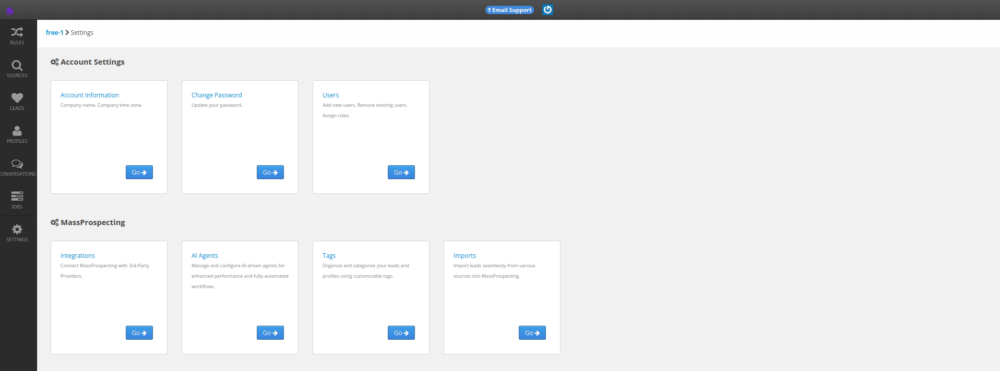
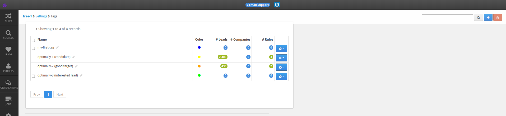
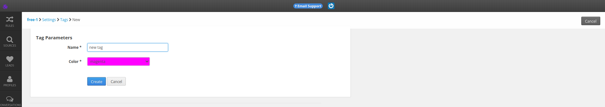

# Tags Management

## Accessing a Sub-Account

You have to access a sub-account first:

1. Login to your MassProspecting account [here](https://massprospecting.com/login).

2. In the left-bar, click on **subaccounts**.

3. Click on the sub-account where you want to add your profiles.

## Accessing the Tags Screen

1. Inside your sub-account, click on **Settings** in the left menu.

2. Click the **Tags** section.

## Creating a New Tag

1. Click on the blue button in the top-right corner of the screen to access the New Tag screen.

2. Once in the New Tag screen, write a name for the tag and choose a color.

3. Click on the Create button.

