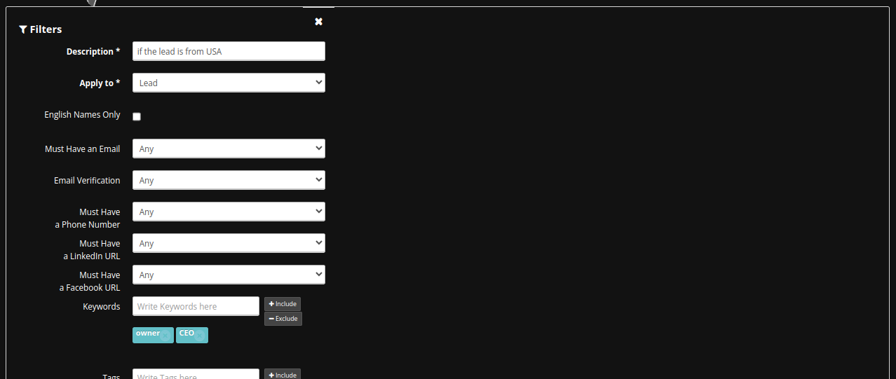

# Tags Management

The tagging system allows users to create, edit, and color-code tags, making it easier to segment and prioritize leads effectively.

## Accessing a Sub-Account

To manage tags, first access the appropriate sub-account:

1. Log in to your MassProspecting account [here](https://massprospecting.com/login).
2. In the left menu, click on **Subaccounts**.
3. Select the sub-account where you want to manage tags.

## Accessing the Tags Screen

1. Inside the sub-account, click on **Settings** in the left menu.

   

2. In the Settings section, click on **Tags**.

   

## Creating a New Tag

1. In the Tags screen, click the **blue button** in the top-right corner to open the New Tag screen.
2. Enter a **name** for the tag and choose a **color**.
3. Click the **Create** button to save the new tag.

   

## Applying Tags to Leads Using Rules

You can automatically assign tags to leads scraped by a source using rules.

### Creating a New Rule to Apply Tags

1. In your sub-account, click on **Rules** in the left menu.
2. Click the **blue button** in the top-left corner to create a new rule.

   

3. In the **Trigger** section:
   - Select **Event Created** in the **Trigger Type** dropdown.
   - Choose the source you want to pick leads from.

   

### Filtering Leads for Tagging

4. In the **Filters** section:
   - Choose **Lead** in the **Apply to** field.
   - Define filter parameters such as job position, location, industry, or company headcount.

   

   **Important:** Ensure the filters match the data provided by the source.  
   Example: If you scrape leads from LinkedIn Public Feed, you can filter by job position but not by company size since that data is not provided.

   

4.b. Alternatively, select **Event** in the **Apply to** field to filter leads based on keywords in the content of posts scraped.

   

   **Note:** Filters are optional. You can close the filter panel by clicking the close icon in the top-right corner.

### Assigning Tags to Filtered Leads

5. In the **Action** section:
   - Select **Add Tag** in the **Action Type** dropdown.
   - Choose the tag you want to assign to the filtered leads.

   
