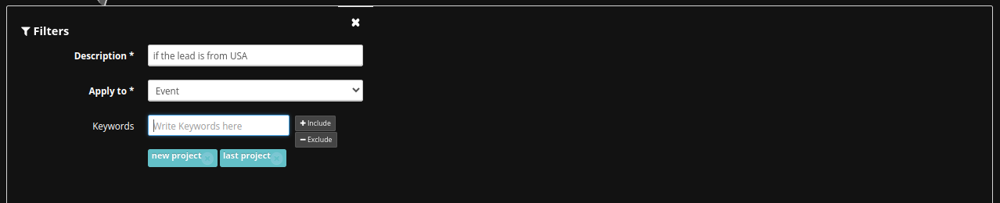

# Tags Management

The tagging system enables users to create, edit, and color-code tags, facilitating better lead segmentation and prioritization.

## Accessing a Sub-Account

You have to access a sub-account first:

1. Login to your MassProspecting account [here](https://massprospecting.com/login).

2. In the left-bar, click on **subaccounts**.

3. Click on the sub-account where you want to add your profiles.

## Accessing the Tags Screen

1. Inside your sub-account, click on **Settings** in the left menu.

2. Click the **Tags** section.

## Creating a New Tag

1. Click on the blue button in the top-right corner of the screen to access the New Tag screen.

2. Once in the New Tag screen, write a name for the tag and choose a color.

3. Click on the Create button.

### Applying Your Tag to Leads with Rules

You can apply your new tag to every new leads scraped by a source.

1. Inside your sub-account, click on **Rules** in the left menu.

2. Click on the blue button in the top-left corner.

3. In the Trigger section, chosse "Event Created" in the **Trigger Type**, and the source you want to pick leads from.

4.a. In the Filters section, choose "Lead" in the **Apply to** field and define parameters to filter the leads scraped, like job position, location, industry or company headcount.

**Important:** Remember to filter by parameters that you know are provided by the source. E.g.: If you are scraping the LinkedIn Public Feed, you have the job position of the leads that appear in the headline of such leads, but you don't have their company size yet.

4.b. Another choice is to choose "Event" in the **Apply to** field in order to filter by some keywords into the content of the posts scraped.

**Note:** Filters are not mandatory. You can click on the close icon in the top-right corner of the filters panel.

5. In the Action section, choose "Add Tag" in the **Action Type**, and choose the tag you want to assign to the triggered leads who passed the filter.

