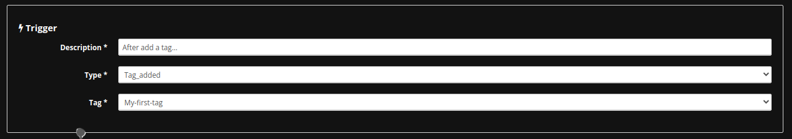
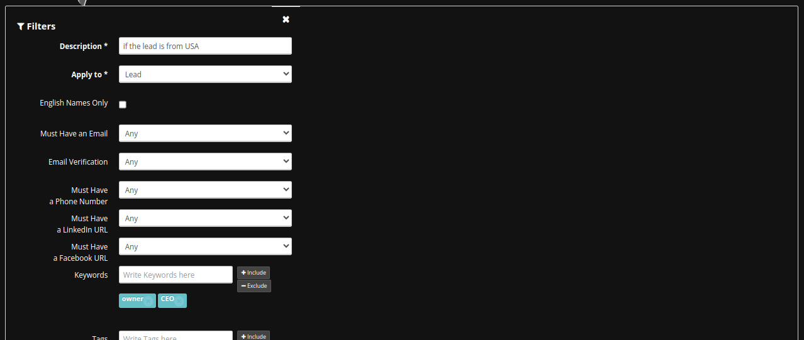
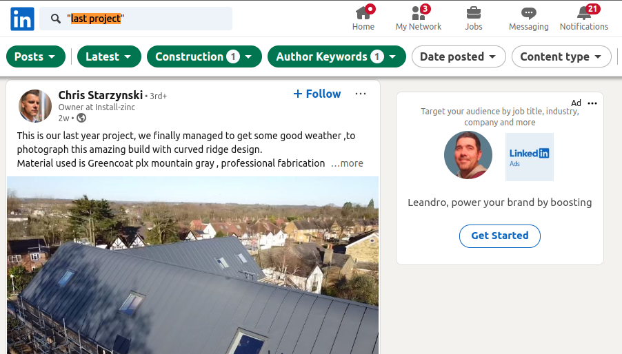
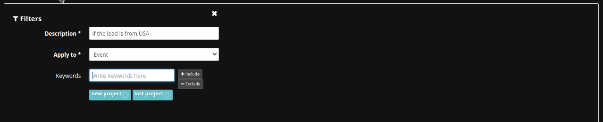
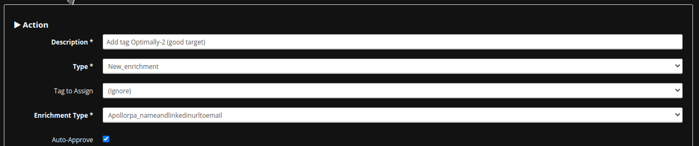

# Leads Enrichment

Leads Enrichment is a powerful feature of MassProspecting that enhances your lead data by filling in missing details and refining existing information. 

With automated rules and enrichment actions, you can augment leads with valuable attributes such as email addresses, phone numbers, company details, and more. This feature integrates with external data providers (e.g., Apollo API, Apollo RPA, FindyMail API) to transform basic lead profiles into enriched and actionable insights, ensuring you have the information needed to effectively engage with prospects.

## Accessing a Sub-Account

To start enriching your leads, access the relevant sub-account:

1. Log in to your MassProspecting account [here](https://massprospecting.com/login).
2. In the left sidebar, click on **Subaccounts**.
3. Select the sub-account where your leads are stored.

## Creating a New Rule for Leads Enrichment

Follow these steps to set up a new rule for enriching your leads:

1. Inside your sub-account, click on **Rules** in the left menu.
2. Click the **blue button** in the top-left corner to create a new rule.

   

3. In the **Trigger** section:
   - Select **Tag Added** as the **Trigger Type**.
   - Choose the tag you want to reference.

   

### Filtering Leads for Enrichment

4. In the **Filters** section, you have two options:

   **Option 1: Filtering Leads by Attributes**
   - Select **Lead** in the **Apply to** field.
   - Define parameters such as job position, location, industry, or company headcount.

     

   **Important:** Ensure the filter criteria match the data provided by the source. For example, if you are scraping the LinkedIn Public Feed, you can filter by job position (available in the headline) but not by company size (not provided by the source).

     

   **Option 2: Filtering by Event Content**
   - Select **Event** in the **Apply to** field to filter leads based on specific keywords found in the content of scraped posts.

     

   **Note:** Filters are optional. You can skip this step by clicking the close icon in the top-right corner of the filters panel.

### Defining the Enrichment Action

5. In the **Action** section:
   - Select **New Enrichment** as the **Action Type**.
   - Choose the **Enrichment Type** to use (e.g., `ApolloAPI_LinkedInToEmail`).

     

   **Important:** Ensure the leads meet the requirements for the selected enrichment type.  
   For example, `ApolloAPI_LinkedInToEmail` requires the LinkedIn URL of the lead to fetch their email address. If you scraped the lead from LinkedIn Public Feed, this field will already be available.

By setting up rules and enrichment actions, you can automate and streamline the process of enhancing your lead data for more effective prospecting.
