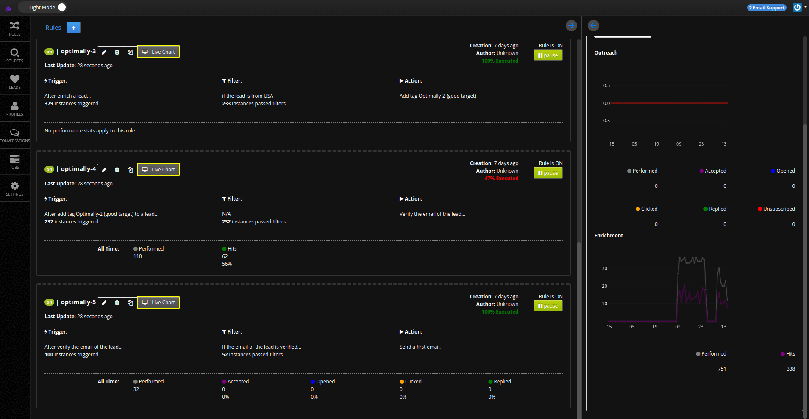
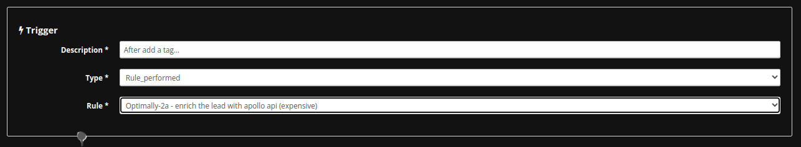
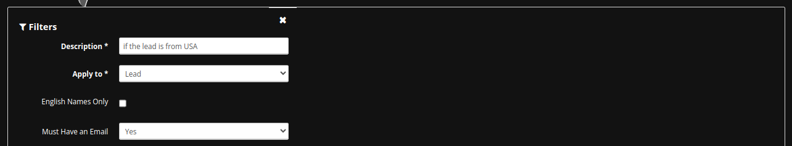
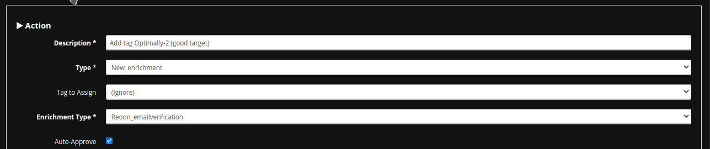

## Emails Verification

_abstract_

## Accessing a Sub-Account

You have to access a sub-account first:

1. Login to your MassProspecting account [here](https://massprospecting.com/login).

2. In the left-bar, click on **subaccounts**.

3. Click on the sub-account where you want to add your profiles.

### Creating a New Rule

1. Inside your sub-account, click on **Rules** in the left menu.

2. Click on the blue button in the top-left corner.

3. In the Trigger section, chosse "Rule Perfomed" in the **Trigger Type**, and the the rule what you to chain this new rule after. E.g.: You can verify the emails appened with the rule explained in the [previous chapter](./08-leads-enrichment.md)

4. In the Filters section, choose "Lead" in the **Apply to** field and define parameters to filter the leads scraped, like job position, location, industry or company headcount.

In this example, you need the lead has an email, so set "Yes" in the "Must Have an Email" field.

**Note:** Even if filters are not mandatory, it is highly recommende you use them in this kind if rules to avoid processing a so many leads that are unnecessary.

5. In the Action section, choose "New Enrichment" in the **Action Type**, and choose "Enrichment Type" to use (e.g.: `Reoon_EmailVerification`)

**Important:** Be sure that the triggered leads already have the parameters required by the enrichment type. E.g.: The enrichment type `Reoon_EmailVerification` requires the email address of the lead. That is why it is important to apply the filter.

