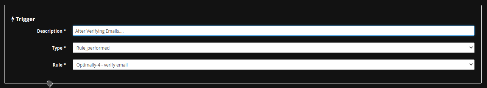
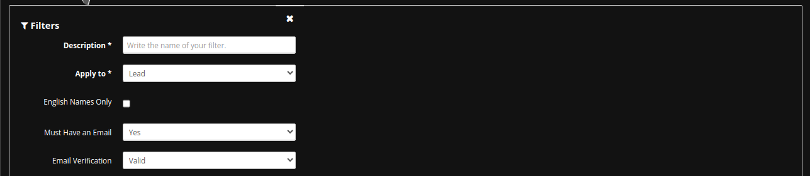
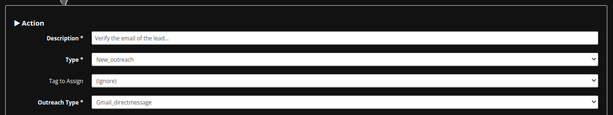

## Leads Outreach

_abstract_

## Accessing a Sub-Account

You have to access a sub-account first:

1. Login to your MassProspecting account [here](https://massprospecting.com/login).

2. In the left-bar, click on **subaccounts**.

3. Click on the sub-account where you want to add your profiles.

### Creating a New Rule

1. Inside your sub-account, click on **Rules** in the left menu.

2. Click on the blue button in the top-left corner.

3. In the Trigger section, chosse "Rule Perfomed" in the **Trigger Type**, and the the rule what you to chain this new rule after. E.g.: You can send cold emails to the leads who passed trough the verification rule explained in the [previous chapter](./09-emails-verification.md)

4. In the Filters section, choose "Lead" in the **Apply to** field and define parameters like job position, location, industry or company headcount.

In this example, you need the lead has an email and such an email is verified, so set "Yes" in the "Must Have an Email" field, and choose "Valid" in the "Email Verification" field.

**Note:** Even if filters are not mandatory, it is highly recommende you use them in this kind if rules to avoid processing a so many leads that are unnecessary; or even worst: to send emails to invalid email addresses.

5. In the Action section, choose "New Outreach" in the **Action Type**, and choose "Outreach Type" to use (e.g.: `Gmail_directmessage`)

.

